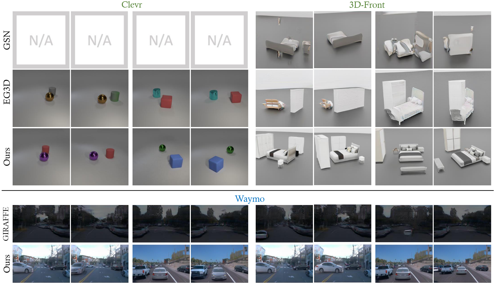
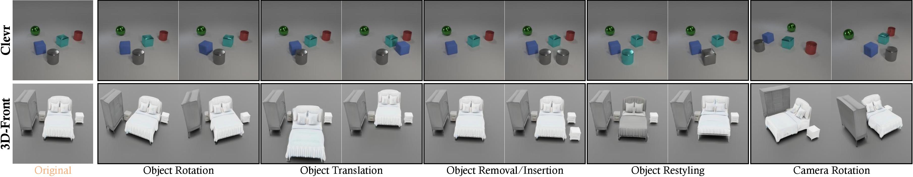
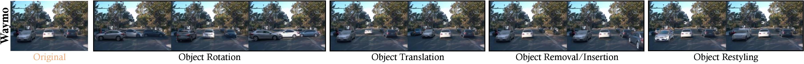
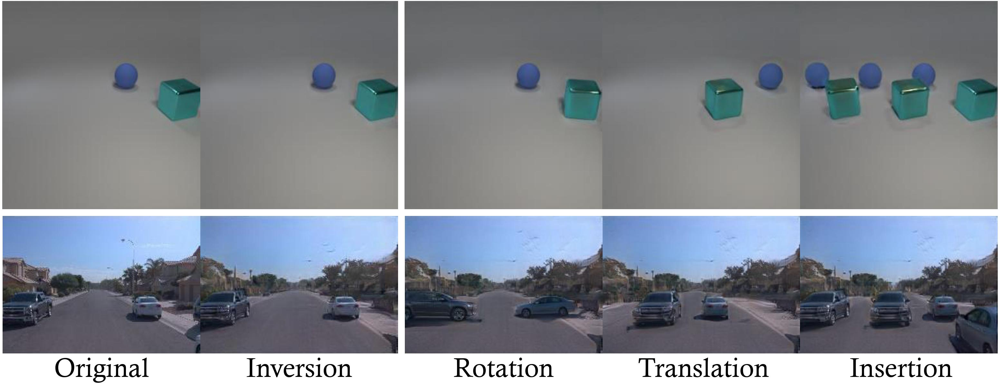

# DiscoScene: Spatially Disentangled Generative Radiance Field for Controllable 3D-aware Scene Synthesis


**Figure:** *Framework of DiscoScene.*

> **DiscoScene: Spatially Disentangled Generative Radiance Field for Controllable 3D-aware Scene Synthesis** <br>
> Yinghao Xu, Menglei Chai, Zifan Shi, Sida Peng, Ivan Skorokhodov, Aliaksandr Siarohin, Ceyuan Yang, Yujun Shen, Hsin-Ying Lee, Bolei Zhou, Sergey Tulyakov <br>

[[Paper]()]
[[Project Page](https://justimyhxu.github.io/discoscene)]
[[Demo](https://www.youtube.com/watch?v=Fvenkw7yeok)]

This work presents DisCoScene: a 3D-aware generative model for high-quality and controllable scene synthesis.
The key ingredient of our approach is a very abstract object-level representation (3D bounding boxes without semantic annotation) as the scene layout prior, which is simple to obtain, general to describe various scene contents, and yet informative to disentangle objects and background. Moreover, it serves as an intuitive user control for scene editing.
Based on such a prior, our model spatially disentangles the whole scene into object-centric generative radiance fields by learning on only 2D images with the global-local discrimination. Our model obtains the generation fidelity and editing flexibility of individual objects while being able to efficiently compose objects and the background into a complete scene. We demonstrate state-of-the-art performance on many scene datasets, including the challenging Waymo outdoor dataset.

## Results

Qualitative comparison with EG-3D and Giraffe.


Controllable scene synthesis.



Real image inversion and editing.



## BibTeX

```bibtex
@article{xu2022discoscene,
     author    = {Xu, Yinghao and Chai, Menglei and Shi, Zifan and Peng, Sida and Skorokhodov Ivan and Siarohin Aliaksandr and Yang, Ceyuan and Shen, Yujun and Lee, Hsin-Ying and Zhou, Bolei and Tulyakov Sergy},
     title     = {DiscoScene: Spatially Disentangled Generative Radiance Field for Controllable 3D-aware Scene Synthesis},
     journal   = {arxiv:},
     year      = {2022},
    }
```